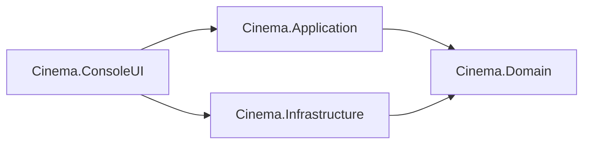

# 🎬 نظام إدارة وحجز تذاكر السينما (C# / .NET 10)

**نظام متكامل لإدارة وحجز تذاكر السينما** — إعادة بناء احترافية لمشروع C++ باستخدام **C#** و **.NET 10**، مع تطبيق **Clean Architecture** و **SOLID Principles**.

[](https://dotnet.microsoft.com/download/dotnet/10.0)
[](https://learn.microsoft.com/dotnet/csharp/)
[](#البنية-المعمارية)
[](#المبادئ-وأنماط-التصميم)
[](#الاختبارات)
[](https://github.com/Ahmed-M-Elsayad/CinemaSystem)
[](https://polyformproject.org/licenses/noncommercial/1.0.0/)

---

## المحتويات

- [نظرة عامة](#نظرة-عامة)
- [تشغيل سريع](#تشغيل-سريع)
- [المميزات](#المميزات)
- [لقطات من التشغيل](#لقطات-من-التشغيل)
- [البنية المعمارية](#البنية-المعمارية)
- [من C++ إلى C#](#من-c-إلى-c)
- [المبادئ وأنماط التصميم](#المبادئ-وأنماط-التصميم)
- [المتطلبات](#المتطلبات)
- [الاستخدام](#الاستخدام)
- [الاختبارات](#الاختبارات)
- [تنسيق ملفات البيانات](#تنسيق-ملفات-البيانات)
- [قيود معروفة](#قيود-معروفة)
- [خارطة الطريق](#خارطة-الطريق)
- [المساهمة](#المساهمة)
- [المؤلف](#المؤلف)
- [الترخيص](#الترخيص)

---

## نظرة عامة

مشروع تعليمي يوضّح **كيفية تحويل مشروع C++ (Procedural) إلى مشروع C# احترافي**. الفكرة مش مجرد نقل الكود لغة بلغة، بل إعادة تصميمه بحيث يكون قابلًا للاختبار والتوسعة:

- 🏛️ **Clean Architecture** — 5 مشاريع منفصلة، وكل التبعيات متجهة نحو الـ Domain
- ✅ **SOLID Principles** — مطبّقة في كل الطبقات
- 💉 **Dependency Injection** — كل Service يستقبل تبعياته من الخارج
- 🔄 **Repository Pattern** — عزل التخزين عن منطق الأعمال
- 🎨 **Strategy Pattern** — خصومات جديدة دون تعديل الكود الموجود
- ⚡ **Async/Await** — عمليات I/O غير معطِّلة
- 🛡️ **Nullable Reference Types** — أمان أكبر ضد `NullReferenceException`
- 🧪 **Unit Testing** — **56 اختبار وحدة** بـ xUnit + Moq + FluentAssertions

---

## تشغيل سريع

```bash
git clone https://github.com/Ahmed-M-Elsayad/CinemaSystem-CSharp.git
cd CinemaSystem-CSharp
dotnet run --project Cinema.ConsoleUI
```

> يحتاج [.NET 10 SDK](https://dotnet.microsoft.com/download/dotnet/10.0) فقط. أمر `dotnet run` يستعيد الحزم ويبني المشروع تلقائيًا.

---

## المميزات

### واجهة الزبون

| الميزة | الوصف |
| :--- | :--- |
| 🎭 عرض الأفلام | استعراض الأفلام المتاحة مع أسعارها |
| 🪑 خريطة المقاعد | عرض توفر المقاعد (`O` = متاح، `X` = محجوز) |
| 🎫 حجز التذاكر | حجز عدة تذاكر دفعة واحدة مع تحقق فوري |
| 💰 الخصومات | خصم تلقائي 10% عند حجز أكثر من 4 تذاكر |
| 📄 التذاكر | عرض على الشاشة + تصدير كملف نصي داخل `receipts/` |

### واجهة المدير

| الميزة | الوصف |
| :--- | :--- |
| 🔑 تسجيل الدخول | كلمة مرور بحد أقصى 3 محاولات |
| 🎬 إدارة الأفلام | إضافة، تعديل (السعر/الحالة)، وحذف |
| 📊 التقارير | إجمالي الأرباح، أعلى فيلم مبيعًا، وتفاصيل كل فيلم |
| 🔍 تحقق ذكي | منع حذف أي فيلم لديه حجوزات نشطة |
| 💾 إدارة الملفات | حفظ وتحميل البيانات دفعة واحدة |

---

## لقطات من التشغيل

> 🚧 **قريبًا** — سيتم إضافة لقطات شاشة للتشغيل داخل مجلد `docs/images/`.

---

## البنية المعمارية

المشروع مقسّم إلى **5 مشاريع**:

```text
CinemaSystem-CSharp/
├── CinemaSystem.slnx
├── README.md
├── LICENSE
├── .gitignore
│
├── Cinema.Domain/            → قلب المشروع (بدون أي تبعيات خارجية)
│   ├── Entities/             → Movie, Hall, Booking
│   ├── ValueObjects/         → SeatMap, SeatPosition, Customer, ...
│   ├── Enums/                → MovieStatus
│   ├── Exceptions/           → DomainException, ValidationException, ...
│   ├── Constants/            → CinemaConstants
│   └── Interfaces/           → العقود (Contracts)
│
├── Cinema.Application/       → منطق الأعمال (Use Cases)
│   ├── Services/             → BookingService, MovieService, ...
│   ├── Pricing/              → StandardPriceCalculator
│   └── Strategies/           → IDiscountStrategy + التنفيذات
│
├── Cinema.Infrastructure/    → التخزين (ملفات)
│   ├── Repositories/         → FileMovieRepository, FileBookingRepository, ...
│   ├── FileSystem/           → LocalFileStorage, DataPaths
│   └── Parsing/              → MovieParser, BookingParser, HallParser
│
├── Cinema.ConsoleUI/         → الواجهة + Composition Root
│   ├── Menus/                → MainMenu, AdminMenu, CustomerMenu
│   ├── Adapters/             → ConsoleInputReader, ConsoleOutputWriter
│   ├── Setup/                → DependencyInjectionSetup
│   ├── Program.cs            → نقطة البداية
│   └── data/                 → halls.txt, movies.txt, bookings.txt
│
└── Cinema.Tests/             → اختبارات الوحدة
    ├── Domain/
    └── Application/
```

### قاعدة التبعيات



> **القاعدة الذهبية:** الـ Domain لا يعرف شيئًا عن أي طبقة أخرى. لو تغيّر التخزين من ملفات إلى قاعدة بيانات، لن يتأثر الـ Domain ولا الـ Application.
> الـ `ConsoleUI` يرتبط بـ `Infrastructure` فقط داخل الـ Composition Root لتسجيل التبعيات.

---

## من C++ إلى C#

| الجانب | C++ (الأصلية) | C# (الحالية) |
| :--- | :--- | :--- |
| اللغة | C++20 | C# 14 |
| نظام البناء | CMake | .NET 10 / `dotnet` CLI |
| البرادايم | Structs + Free Functions | OOP + Classes |
| البنية | ملفات مسطّحة | 5 مشاريع (Clean Architecture) |
| الحالة العامة | `extern vector` (Global State) | DI Container |
| المبادئ | تقليدي | SOLID |
| الاختبار | صعب | Unit Tests (xUnit + Moq) |
| التوسعة | محدودة | مرنة (Open/Closed) |
| إدارة الذاكرة | يدوية (Pointers) | تلقائية (GC) |

### أهم التحسينات

**1. من Structs بسيطة إلى Rich Domain Model**
- *قبل:* بيانات خام بدون قواعد حماية.
- *بعد:* كائنات تحافظ على حالتها وتمنع القيم غير الصالحة (Encapsulation).

**2. من Global State إلى Dependency Injection**
- *قبل:* متغيرات عامة مستخدمة في كل مكان.
- *بعد:* DI Container يعزل التبعيات ويسهّل الاختبار.

**3. من `if/switch` المكرر إلى Strategy Pattern**
- *قبل:* تعديل الدوال الموجودة عند كل ميزة جديدة.
- *بعد:* إضافة خصم جديد بإنشاء Class جديد فقط، دون تعديل القديم (OCP).

---

## المبادئ وأنماط التصميم

| المبدأ | التطبيق |
| :--- | :--- |
| **SRP** | لكل Service مسؤولية واحدة (`BookingService`, `MovieService`, ...) |
| **OCP** | `IDiscountStrategy` — إضافة خصومات جديدة دون تعديل الموجود |
| **LSP** | `IFileStorage` قابل للاستبدال بقاعدة بيانات أو Cloud أو Mock |
| **ISP** | واجهات صغيرة منفصلة (`IReadableRepository`, `IWritableRepository`) |
| **DIP** | كل Service يستقبل تبعياته عبر الـ Constructor |

### أنماط التصميم المستخدمة

- **Repository** — عزل التخزين
- **Strategy** — الخصومات
- **Factory** — إنشاء الكيانات
- **Dependency Injection** — إدارة التبعيات
- **Adapter** — واجهات الإدخال/الإخراج
- **Facade** — `DataPersistenceService`

### مثال: إضافة خصم جديد

أنشئ Class جديد يطبّق `IDiscountStrategy`:

```csharp
public sealed class StudentDiscountStrategy : IDiscountStrategy
{
    public decimal CalculateDiscount(decimal originalPrice, int seatCount)
    {
        // خصم 15% للطلاب
        return originalPrice * 0.15m;
    }
}
```

ثم سجّله في الـ DI — بدون تعديل أي Service موجود:

```csharp
// في DependencyInjectionSetup.cs
services.AddSingleton<IDiscountStrategy, StudentDiscountStrategy>();
```

---

## المتطلبات

- [.NET 10 SDK](https://dotnet.microsoft.com/download/dotnet/10.0)
- Visual Studio أو VS Code أو JetBrains Rider
- Windows / Linux / macOS

---

## الاستخدام

### كزبون

1. اختر **Customer Mode**.
2. اختر الفيلم، ثم حدّد المقاعد من الخريطة (`O` متاح، `X` محجوز).
3. أدخل بياناتك لتحصل على الإجمالي والخصم التلقائي وتذكرتك.

### كمدير

1. اختر **Admin Mode** وأدخل كلمة المرور (3 محاولات كحد أقصى).
2. أدر الأفلام (إضافة/تعديل/حذف) واطّلع على تقارير الأرباح.

> ⚠️ **تنبيه:** كلمة المرور الافتراضية `admin123` مخصصة للتجربة والأغراض التعليمية فقط. غيّرها قبل أي استخدام فعلي.

---

## الاختبارات

المشروع يحتوي على **56 اختبار وحدة** تغطي طبقتي Domain و Application، **جميعها تمر بنجاح**.

```bash
# تشغيل كل الاختبارات
dotnet test

# عرض قائمة الاختبارات
dotnet test --list-tests
```

**النتيجة المتوقعة:**

```text
Test summary: total: 56, failed: 0, succeeded: 56, skipped: 0
```

### ما الذي يغطيه الاختبار

| الفئة | التغطية |
| :--- | :--- |
| `SeatMapTests` | الحجز، الإلغاء، حجز عدة مقاعد، حدود الصفوف والأعمدة |
| `BookingDateTests` | التحقق من اليوم والشهر والسنة |
| `StandardPriceCalculatorTests` | حساب السعر والتحقق من المدخلات |
| `BulkTicketDiscountStrategyTests` | منطق خصم الكمية |
| `BookingServiceTests` | الإنشاء، الإلغاء، الجلب بالمعرّف، المعاينة |
| `MovieServiceTests` | الإضافة، التعديل، الحذف، الجلب بالمعرّف |

### التقنيات المستخدمة

- **xUnit** — إطار الاختبارات
- **Moq** — محاكاة الـ Repositories
- **FluentAssertions** — تحسين قراءة الـ assertions

---

## تنسيق ملفات البيانات

كل الملفات نصية داخل `Cinema.ConsoleUI/data/`، والفاصل بين الحقول هو `|`.

### `halls.txt`

```text
hallId|name|rows|cols|isVip
1|Main Hall|5|6|0
2|VIP Hall|4|5|1
```

### `movies.txt`

السطر الأول بيانات الفيلم، ثم سطر الأبعاد، ثم خريطة المقاعد.

```text
movieId|name|genre|showtime|price|hallId|status
rows|cols
[seat rows...]
```

**مثال:**

```text
1|Action Movie|Action|8:00 PM|100|1|Now Showing
5|6
OOOOOO
OOOOOO
OOOOOO
OOOOOO
OOOOOO
```

**رموز المقاعد:**

| الرمز | المعنى |
| :---: | :--- |
| `O` | مقعد متاح |
| `X` | مقعد محجوز |

### `bookings.txt`

```text
bookingId|movieId|movieName|seatCount|pricePerSeat|originalPrice|discount|total|isActive|isPaid
customerId|customerName|phone
row col            ← سطر لكل مقعد
day month year
```

**مثال:** حجز مقعدين في الصف 2 (العمودان 3 و4):

```text
1|1|Action Movie|2|100|200|0|200|1|1
10|Ahmed Ali|01012345678
2 3
2 4
15 6 2026
```

> ملف `bookings.txt` يُولَّد تلقائيًا عند الحجز ويحتوي بيانات المستخدمين، لذلك مُستبعد من Git.

---

## قيود معروفة

- الحرف `|` غير مسموح داخل أسماء الأفلام أو العملاء، لأنه الفاصل في ملفات البيانات.
- التخزين في ملفات نصية، فهو مناسب للتعلّم وليس لعدة مستخدمين في وقت واحد.
- كلمة مرور المدير غير مُشفّرة (انظر خارطة الطريق).

---

## خارطة الطريق

- [ ] استبدال التخزين بالملفات بـ SQLite عبر EF Core (مثال عملي على فائدة الـ Repository Pattern)
- [ ] تخزين كلمة المرور كـ Hash بدل نص صريح (مع Salt)
- [ ] إضافة أكثر من قاعة وأكثر من عرض لكل فيلم
- [ ] ربط GitHub Actions لتشغيل البناء والاختبارات تلقائيًا
- [ ] قياس تغطية الاختبارات (Code Coverage)
- [ ] إضافة لقطات شاشة للتشغيل
- [ ] واجهة ويب أو Web API فوق نفس طبقة الـ Application

---

## المساهمة

المساهمات مرحّب بها:

1. اعمل Fork للمستودع.
2. أنشئ فرعًا جديدًا: `git checkout -b feature/my-feature`
3. نفّذ التعديلات مع إضافة اختبارات مناسبة.
4. افتح Pull Request يشرح ما تم تغييره.

---

## المؤلف

**Ahmed Mohamed Ahmed Saber**
🎓 طالب هندسة كهربية (دفعة 2029) · 💼 مطوّر Embedded Systems & IoT

- GitHub: [@Ahmed-M-Elsayad](https://github.com/Ahmed-M-Elsayad)
- LinkedIn: [Ahmed Mohamed](https://www.linkedin.com/in/ahmed-mohamed-ahmed-saber-abdelhamid-b46249324)
- Email: a.elsuad08@gmail.com

### روابط المشروع

- النسخة الأصلية (C++): [CinemaSystem](https://github.com/Ahmed-M-Elsayad/CinemaSystem)
- النسخة الحالية (C# Clean Architecture): هذا المستودع

### فريق العمل في نسخة C++ الأصلية

- [@Ahmed-M-Elsayad](https://github.com/Ahmed-M-Elsayad) — Team Leader & Architect
- [@Redaelkplawy](https://github.com/Redaelkplawy) — Developer
- [@omaralqblawy](https://github.com/omaralqblawy) — Developer

---

## الترخيص

هذا المشروع مرخّص تحت **PolyForm Noncommercial License 1.0.0**.

[](https://polyformproject.org/licenses/noncommercial/1.0.0/)

### ✅ الاستخدامات المسموحة (بدون إذن)

- الاستخدام الشخصي والتعلم الذاتي
- الأبحاث الأكاديمية والمشاريع التعليمية
- التجارب غير التجارية
- العرض في Portfolio أو للتقديم على وظائف
- المنظمات التعليمية والخيرية والحكومية

### ❌ الاستخدامات الممنوعة (بدون إذن كتابي)

- أي استخدام تجاري أو لتحقيق ربح
- البيع أو الترخيص من البُعد
- الدمج في منتج أو خدمة مدفوعة
- تقديم المشروع كخدمة مدفوعة
- استخدامه في عمل استشاري أو Freelance

### 💼 الترخيص التجاري

لاستخدام تجاري، تواصل مع:
- **Email**: a.elsuad08@gmail.com
- **GitHub**: [@Ahmed-M-Elsayad](https://github.com/Ahmed-M-Elsayad)

> **ملاحظة**: PolyForm Noncommercial هو ترخيص **Source-Available** معترف به من قبل [PolyForm Project](https://polyformproject.org/).
> GitHub يعرضه باسمه الرسمي مع معرف SPDX: `PolyForm-Noncommercial-1.0.0`.

---

<div align="center">

🎬 استمتع بتجربة نظام السينما! 🍿

صُنع بـ ❤️ باستخدام C# و Clean Architecture

⭐ لو أعجبك المشروع، لا تنسَ وضع Star!

</div>